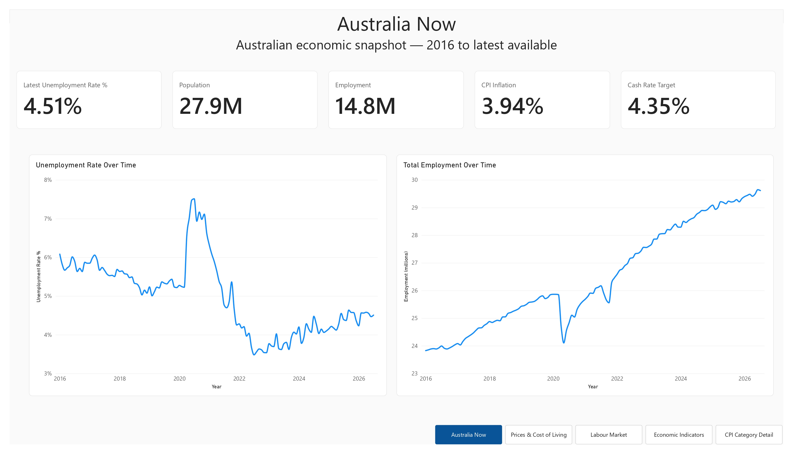
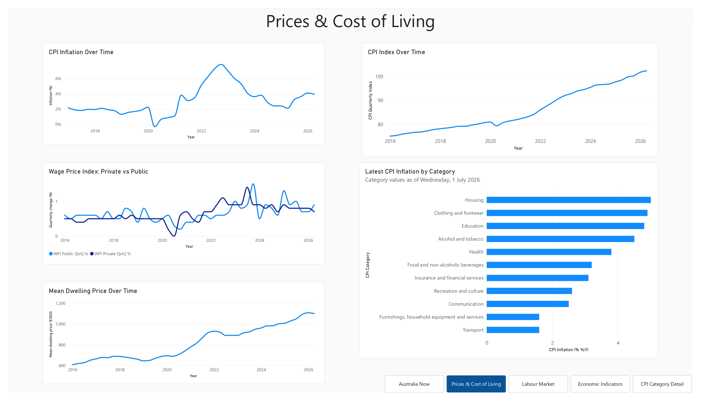
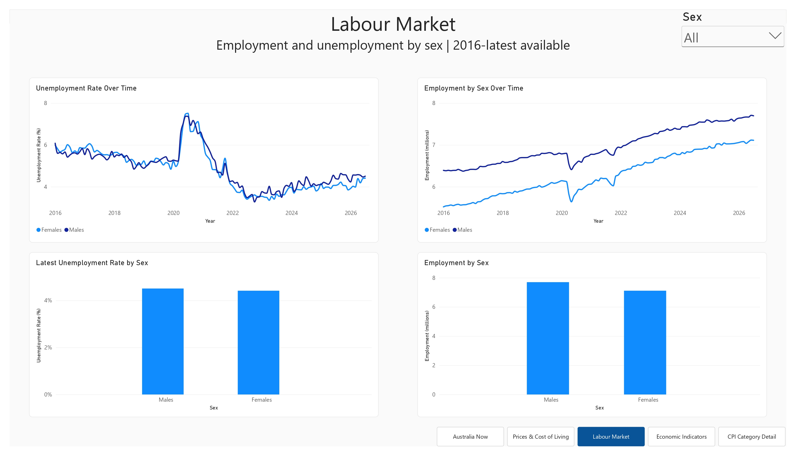
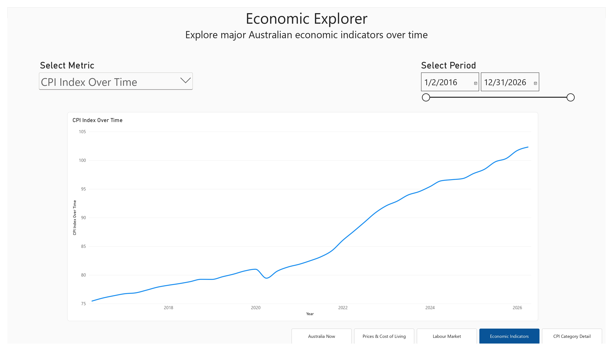
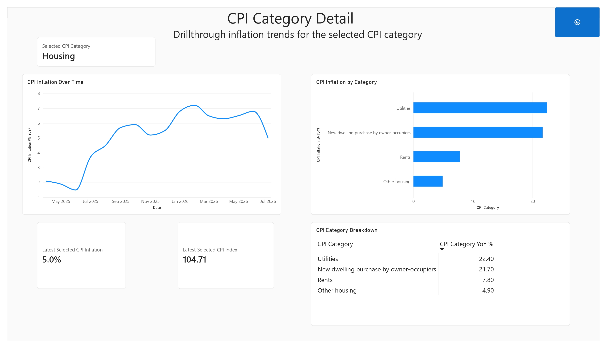

# Australian Economic Snapshot

An interactive Power BI dashboard exploring key Australian economic indicators from 2016 to the latest available data in the datasets used for the project.

This was built as a **practical portfolio project while learning Power BI**, with a focus on developing skills such as Power Query, DAX and interactive reporting.

## Dashboard

The report is organised into five pages, moving from high-level economic snapshot into more focused labour-market, interactive metric and CPI analysis.

### 1. Australia Now

The overview page provides a snapshot of Australia's economy using five key indicators:

* Unemployment rate
* Population
* Employment
* CPI inflation
* Cash rate target

It also includes time-series views of unemployment and employment to provide context around recent changes.



### 2. Prices & Cost of Living

This page focuses on indicators related to prices, wages and housing.

It includes:

* CPI inflation over time
* CPI quarterly index
* Private-sector vs public-sector wage growth
* Mean dwelling price
* Latest CPI inflation

The page is intended to provide a broader view of changes in prices and cost-of-living-related indicators rather than relying on CPI alone. It also includes a drillthrough option on Latest CPI inflation graph.



### 3. Labour Market

The labour-market page focuses on employment and unemployment trends.

An interactive slicer allows user to examine the labour-market data across different groups while retaining the same report layout.



### 4. Interactive Economic Metric

I use a Field Parameter to allow the user to switch the main chart between three different economic indicators:

* Population
* CPI quarterly index
* Cash rate target

User can also select the period of time, ranging from the beginning of 2016 to now.



### 5. CPI Category Detail

The CPI Category Detail page is accessed using Power BI drillthrough from Price & Cost of Living page's CPI inflation by category bar chart. It provides a more detailed view of consumer price changes, including:

* CPI inflation over time
* CPI category year-on-year changes
* Latest selected CPI inflation
* Latest selected CPI index
* Category-level comparison in a matrix

The CPI data is structured across multiple category levels, allowing the report to move from the overall CPI measure into more detailed categories.



## Key Features

### Interactive reporting

The dashboard uses slicers, field parameters, drillthrough and navigation controls to allow users to explore the data instead of relying on static charts.

### DAX measures

Custom DAX measures were created for calculated indicators and dynamic reporting, including:

* Employment totals
* Unemployment metrics
* Latest available values
* Cash rate selection
* Dynamic metric selection
* Dynamic chart titles

### Notable field parameters

A field parameter is used on the Interactive Economic Metric page to switch between Population, CPI Quarterly Index and Cash Rate Target without requiring separate charts.

```DAX
Economic Metric = {
    ("Population (M)", NAMEOF('Population'[Population]), 0),
    ("CPI Quarterly Index", NAMEOF('CPI_from2016'[CPI Quarterly Index]), 1),
    ("Cash Rate Target Measure", NAMEOF('Cash Rate'[Cash Rate Target Measure]), 2)
}
```

A separate DAX measure returns the value associated with the selected metric.

```DAX
Selected Metric Value = 
VAR Metric =
    SELECTEDVALUE(
        'Economic Metric'[Economic Metric]
    )
RETURN
    SWITCH(
        Metric,
        "Population (M)", [Population],
        "CPI Quarterly Index", [CPI Quarterly Index],
        "Cash Rate Target Measure", [Cash Rate Target Measure],
        BLANK()
    )
```

### Dynamic titles

The interactive chart uses a dynamic title so that the title changes when the selected economic metric changes.

For example:

```text
Population Over Time
CPI Index Over Time
Cash Rate Target Over Time
```

### Drillthrough

The CPI Deep Dive page uses drillthrough functionality to move from the broader CPI analysis into a more detailed category-level view.

### Date-based analysis

A shared DimDate dimension is used to support time-series analysis and consistent date filtering across the different datasets.

The cash-rate calculation also accounts for the different reporting frequency of the cash-rate series by using the latest available observation **on or before** the selected report date.

## Data Sources

The dashboard combines Australian economic datasets from the **Australian Bureau of Statistics (ABS)** and the **Reserve Bank of Australia (RBA)**.

### Australian Bureau of Statistics

#### Consumer Price Index — June 2026

The CPI publication was used for detailed CPI data, including **Table 17**, which provides the category-level information used in the CPI analysis.

[ABS — Consumer Price Index, Australia, June 2026](https://www.abs.gov.au/statistics/economy/price-indexes-and-inflation/consumer-price-index-australia/jun-2026#data-downloads)

#### Labour Force, Australia

The Labour Force dataset was used for employment and unemployment analysis.

[ABS — Labour Force, Australia](https://www.abs.gov.au/statistics/labour/employment-and-unemployment/labour-force-australia/latest-release)

#### Population and components of change — national, states and territories

**Dataset:** `ERP_COMP_Q`
**Catalogue:** 3218.0
**Measure used:** Estimated Resident Population

[ABS Data Explorer — ERP_COMP_Q](https://dataexplorer.abs.gov.au/vis?tm=Population&pg=0&snb=239&df[ds]=PEOPLE_TOPICS&df[id]=ERP_COMP_Q&df[ag]=ABS&df[vs]=1.0.0&isAvailabilityDisabled=false&page=0)

#### Consumer Price Index (CPI)

**Dataset:** `CPI`
**Catalogue:** 6401.0
**Measure used:** CPI index and related CPI measures
**Index:** All groups CPI

[ABS Data Explorer — CPI](https://dataexplorer.abs.gov.au/vis?tm=Consumer%20Price%20Index%20%28CPI%29&pg=0&snb=7&df[ds]=ECONOMY_TOPICS&df[id]=CPI&df[ag]=ABS&df[vs]=2.0.0&isAvailabilityDisabled=false&page=0)

#### Wage Price Index

The Wage Price Index was used to compare changes in private-sector and public-sector wages over time.

**Dataset:** `WPI`
**Catalogue:** 6345.0
**Measure used:** Quarterly Index

[ABS Data Explorer — Wage Price Index](https://dataexplorer.abs.gov.au/vis?tm=Wage%20Price%20Index%20%28WPI%29&pg=0&snb=1&df[ds]=ECONOMY_TOPICS&df[id]=WPI&df[ag]=ABS&df[vs]=1.2.0&isAvailabilityDisabled=false&page=0)

#### Residential Dwellings: Values, Mean Price and Number by State and Territories

The dwelling-price dataset was used for mean residential dwelling prices.

**Dataset:** `RES_DWELL_ST`
**Catalogue:** 6416.0
**Measure used:** Mean price of residential dwellings

[ABS Data Explorer — Residential Dwellings](https://dataexplorer.abs.gov.au/vis?tm=Dwelling%20prices&pg=0&snb=27&df[ds]=ECONOMY_TOPICS&df[id]=RES_DWELL_ST&df[ag]=ABS&df[vs]=1.0.0&isAvailabilityDisabled=false&page=0)

### Reserve Bank of Australia

#### Cash Rate Target

The RBA cash-rate series was used for the cash rate target indicator in the dashboard.

[RBA — Cash Rate](https://www.rba.gov.au/statistics/cash-rate/)

## Data Preparation & Modelling

The project combines multiple datasets that use different structures, measures and reporting frequencies.

The main tables in the Power BI model include:

```text
DimDate
Population
Labour Force
CPI_from2016
WPI
Dwellings
Cash Rate
```

As I have mentioned before, shared `DimDate` table is used to support consistent time-based analysis across the report.

The data preparation process included:

* Cleaning and transforming source data
* Standardising dates and measures
* Separating CPI measures from CPI index values
* Handling CPI category hierarchy levels
* Creating calculated measures in DAX
* Validating values and filters across visuals
* Accounting for differences in reporting frequency between datasets

## Selected Analysis

The dashboard was also used to explore several patterns in Australian economic data.

### Labour market

Employment and unemployment show a clear disruption around 2020, followed by a recovery in the years after the initial COVID-19 shock.

### Inflation

CPI inflation was relatively subdued during parts of the earlier period before increasing substantially during the post-2020 period.

The CPI Deep Dive also shows that inflation varies considerably across individual categories, meaning the overall CPI figure does not move uniformly across all components.

### Wages

The Wage Price Index allows private- and public-sector wage growth to be compared over time, showing differences in the pace of wage changes between the two groups.

### Cash rate

The cash rate provides additional context for the broader economic trends shown elsewhere in the dashboard, particularly when viewed alongside inflation and labour-market indicators.

These observations are presented as descriptive analysis of the underlying datasets rather than economic forecasts or investment advice.

## Skills Demonstrated

This project was built to develop and demonstrate practical skills in:

* Power BI
* Power Query
* DAX
* Data modelling
* Data transformation
* Time-series analysis
* Interactive dashboard design
* Field parameters
* Dynamic titles
* Drillthrough
* Slicers and filtering
* Data validation
* Working with multiple datasets and reporting frequencies

## What I Learned

Building the dashboard provided practical experience beyond simply creating individual charts.

The main areas of learning were:

* Designing a multi-page report around a consistent analytical theme
* Modelling multiple datasets in Power BI
* Creating reusable DAX measures
* Working with date-based calculations
* Handling indicators reported at different frequencies
* Using field parameters to make visuals more interactive
* Creating dynamic titles based on user selections
* Building drillthrough workflows
* Balancing information density with dashboard readability

## Project Structure

```text
australian-economic-snapshot/
│
├── README.md
│
├── screenshots/
│   ├── 01-australia-now.png
│   ├── 02-prices-cost-of-living.png
│   ├── 03-labour-market.png
│   ├── 04-interactive-economic-metric.png
│   └── 05-cpi-deep-dive.png
│
└── powerbi/
    └── Australian_Economic_Snapshot.pbix
```

## Project Status

**Completed**

## Future Improvements

Potential future extensions could include:

* Adding additional economic indicators
* Expanding the time period as new data becomes available
* Adding geographical analysis where suitable data is available
* Introducing additional comparison and decomposition features
* Improving report navigation and accessibility

---

### About the Project

This project was created as part of my transition from learning Power BI concepts to applying them in a complete data-analysis workflow.

Rather than focusing only on individual Power BI features, the goal was to build a coherent report around a real-world dataset and practise the full process of preparing data, modelling it, creating measures, designing visuals and adding interactivity.
